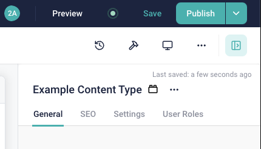
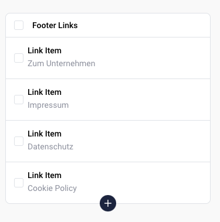
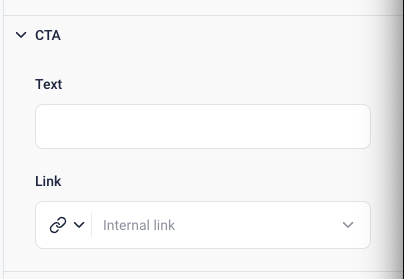

# Fields

The content of every component is configured (and then managed by the editor) via input fields.

## Editor Configuration

### EditorTab

The top most level of customizing the input UI of Storyblok is by using tabs:



By default, all elements not in tabs, will be included in the `General` tab in the UI.

But you can add custom tabs:

```php
use Torr\Storyblok\Field\Group\EditorTab;

protected function configureFields () : array
{
	return [
		"tab-seo" => new EditorTab("SEO", [
			"meta-description" => new TextField("Meta-Description"),
		]),
		"tab-settings" => new EditorTab("SEO", [
			"hide-in-main-navigation" => new BooleanField("Hide in Main Navigation"),
		]),
	];
}
```

:::tip
Please note, that while editor tabs are no input elements and are not exported as themselves via the JSON
API, they will reserve a field name key in the list. It is recommended to prefix these field names with `tab-`, like seen above.
:::


## Default Options & Settings

All fields have default options and settings.

- `label`: the label shown in the admin UI
- `defaultValue`: (if applicable) the default value of the field

You can define additional settings with methods, define your component like this

```php
protected function configureFields () : array
{
	return [
		"field" => (new TextField("Label")) // you need to wrap the constructor in parentheses
			->enableValidation(),			// this is one of these methods
	];
}
```

### `->enableValidation()`

Enables validation for this field.

- `$required`: marks this field as required
- `$regexp`: an optional regex, to use as additional validation for this field
- `$allowMissingData`: if enabled, the validation constraints are pushed to Storyblok, but are not enforced when validating the entry locally.

The option for allowing missing data is crucial, when adding required fields after content was already added. If we would add a new required field, the deployment would immediately fail
as required content missing is a breaking error. By enabling this setting, you will push and enforce these rules in Storyblok (so all newly saved stories will be valid), but allow missing data locally in unchanged stories.

This enables you to do a migration over time. After all content was updated, you can disable this setting again and enforce the rules everywhere.


### `->useAsAdminDisplayName()`

Uses this field as a display name in the backend. Enabling this will use the value of this field to render as a label for this element in a listing.

For example, in this case the label of the link is used as admin display name:




:::caution
You should only enable this for a single field in a component.
Enabling it for multiple fields is undefined.
:::


### `->enableTranslations()`

Enables [field level translations] for this field.


### `->addDescription()`

Adds a text description to this input.

You can decide whether it should be visible as a tooltip instead of under the input field, by passing `$showAsTooltip = true`.


## Fields Reference

There is a list of predefined input fields, that are ready to use. All options have the default options described above,
but some have additional field-specific options.


### AssetField

A selector to select one or multiple assets.

#### Custom Options

| Option              | Description                                                                   |
|---------------------|-------------------------------------------------------------------------------|
| `$fileTypes`        | The file types to allow. Use the `AssetFileType` enum for all allowed values. |
| `$allowMultiple`    | Whether to allow selecting multiple assets.                                   |
| `$allowExternalUrl` | Whether to also allow adding external URLs as assets.                         |

You can manually order the items in multi-select mode.


### BloksField

A field to embed nestable components.

| Option                  | Description                                 |
|-------------------------|---------------------------------------------|
| `$minimumNumberOfBloks` | Minimum number of bloks                     |
| `$maximumNumberOfBloks` | Maximum number of bloks.                    |
| `$allowedComponents`    | Restrict the type of embeddable components. |


:::tip
If you have a single embeddable component (so `$maximumNumberOfBloks = 1` and only a single specific type),
prefer to use a `FieldGroup` with inline field definitions instead. It has a much simpler UI.
:::


### BooleanField

A checkbox field.


### ChoiceField

A selection field.

#### Custom Options

| Option              | Description                                                                   |
|---------------------|-------------------------------------------------------------------------------|
| `$choices`          | The file types to allow. Use the `AssetFileType` enum for all allowed values. |
| `$allowMultiselect` | Whether to allow selecting multiple entries.                                  |


#### Choice Sources

The selection can display different kind of choices.

- `DatasourceChoices`: load choices from a data source in this space.
- `LanguagesChoices`: selection of Storyblok-defined languages.
- `StaticChoices`: a list of statically defined choices.
- `StoryChoices`: a selector to select other stories.


:::note
As we don't use Storyblok translations, the list of languages doesn't make sense for our projects.

If you need a selector to select languages, use `StaticChoices`, filled with locales from `AppLocales` instead.
:::


### DateTimeField

A date or datetime selector.

#### Custom Options

| Option               | Description                                           |
|----------------------|-------------------------------------------------------|
| `$withTimeSelection` | Option to be able to select date + time or date only. |


### LinkField

A field to generate a link to another element.

Will always allow to link to an internal story or an external URL.


#### Custom Options

| Option               | Description                                                                             |
|----------------------|-----------------------------------------------------------------------------------------|
| `$allowEmailLinks`   | Allows adding e-mail links.                                                             |
| `$allowAssetLinks`   | Allows linking to an asset.                                                             |
| `$allowAnchors`      | Add a custom text anchor to an internal link.                                           |
| `$internalLinkScope` | Scope to restrict the story selector to. See the Storyblok docs for the pattern format. |
| `$allowedComponents` | Restrict the type of selectable stories.                                                |


### MarkdownField

A field to enter rich text content in the markdown format.


#### Custom Options

| Option             | Description                                         |
|--------------------|-----------------------------------------------------|
| `$hasRichMarkdown` | Enables rich markdown view by default.              |
| `$maxLength`       | Restrict content length.                            |
| `$isRightToLeft`   | Whether the content is in a right-to-left language. |


:::tip
Always prefer using a RichTextField instead.
:::


### NumberField

A field to add a number.


:::warning
The formatting options are not yet configurable.
:::


### RichTextField

Field to edit formatted text content.

#### Custom Options

| Option               | Description                                                                         |
|----------------------|-------------------------------------------------------------------------------------|
| `$maxLength`         | Restrict content length.                                                            |
| `$allowedComponents` | Restrict the type of embeddable components.                                         |
| `$toolbarOptions`    | Toolbar buttons / features to enable in the editor. Use the `RichTextStyling` enum. |
| `$styleOptions`      | Custom selectable inline styles.                                                    |

The `$styleOptions` are inline styles, that will be set as class names on the surrounding inline tag when rendering.

The format of the array is

```php
[
	"ui label1" => "css class name1",
	"ui label2" => "css class name2",
	// ...
]
```


### TextField

Simple (unformatted) text input field.

#### Custom Options

| Option           | Description                                         |
|------------------|-----------------------------------------------------|
| `$multiline`     | Whether to enable multiline input.                  |
| `$maxLength`     | Restrict content length.                            |
| `$isRightToLeft` | Whether the content is in a right-to-left language. |


## Grouping Elements

Grouping fields are elements, that combine a bunch of other input fields to clean up the Storyblok UI.


### CompositeField

A composite field is a custom field, that acts like a field group (it is configured to the same Storyblok input type), but is easier to reuse.

You define your composite field once:

```php
use Torr\Storyblok\Field\Definition\LinkField;
use Torr\Storyblok\Field\Definition\TextField;
use Torr\Storyblok\Field\Group\CompositeField;

class CTAField extends CompositeField
{
	protected function configureFields () : array
	{
		return [
			"text" => new TextField("Text"),
			"link" => new LinkField("Link"),
		];
	}
}
```

And then you can use it like a regular field in your app:

```php
protected function configureFields () : array
{
	return [
		"cta" => new CTAField("CTA"),
	];
}
```

### FieldGroup

A field group combines multiple fields in a single, collapsible UI element.




```php
use Torr\Storyblok\Field\Group\FieldGroup;
use Torr\Storyblok\Field\Definition\TextField;
use Torr\Storyblok\Field\Definition\LinkField;


protected function configureFields () : array
{
	return [
		"cta" => new FieldGroup("CTA", [
			"text" => new TextField("Text"),
			"link" => new LinkField("Link"),
		]),
	];
}
```

The data values will also be wrapped in the key of this group, so in this case in `[cta][text]` and `[cta][link]`.


### Notes About Grouping Fields


Please keep in mind, that in Storyblok, the fields are a flat list. As the grouping elements in this bundle
are nested, the bundle needs to generate prefixes for the field names, to avoid conflicts with other, regular fields.

So for example, this definition:

```php
protected function configureFields () : array
{
	return [
		"text" => new TextField("Text"),
		"cta" => new FieldGroup("CTA", [
			"text" => new TextField("Text"),
			"link" => new LinkField("Link"),
		]),
	];
}
```

should work, however a naive implementation will lead to a field name collision for `text`.

That's why the bundle automatically generates prefixes for nested fields, by sluggifying the label of the grouping field.
So in this case the fields will be named:

- `text`
- `cta`
- `cta_text`
- `cta_link`

If the automatic prefix generation fails or generates a weird prefix, you can always pass your own custom prefix in the constructor of these fields.

## Adding Custom Fields

You can add custom fields, by extending `AbstractField`.
Please be aware, that there needs to be a corresponding supported field type on the site of Storyblok too, though.


[field level translations]: https://www.storyblok.com/tp/setup-field-and-folder-level-translation#field-level-translation
