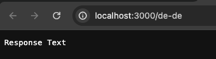

# HTTP Auth Middleware

A helper that integrates a HTTP Basic Auth into the Next.js Middleware.

```typescript
import {handleHttpBasicAuth} from "@21torr/dune/next/middleware/http-auth";

const middleware: NextMiddleware = (request) =>
{
	const authResponse = handleHttpBasicAuth(
		request,
		username,
		password,
		responseText = "Auth required",
		realmLabel = "Secure Area",
	);

	if (authResponse)
	{
		return authResponse;
	}

	// do you regular middleware work here
};
```

The parameters `responseText` and `realmLabel` have defaults as written above. The response text is the text that is shown to the user if the authentication fails:


